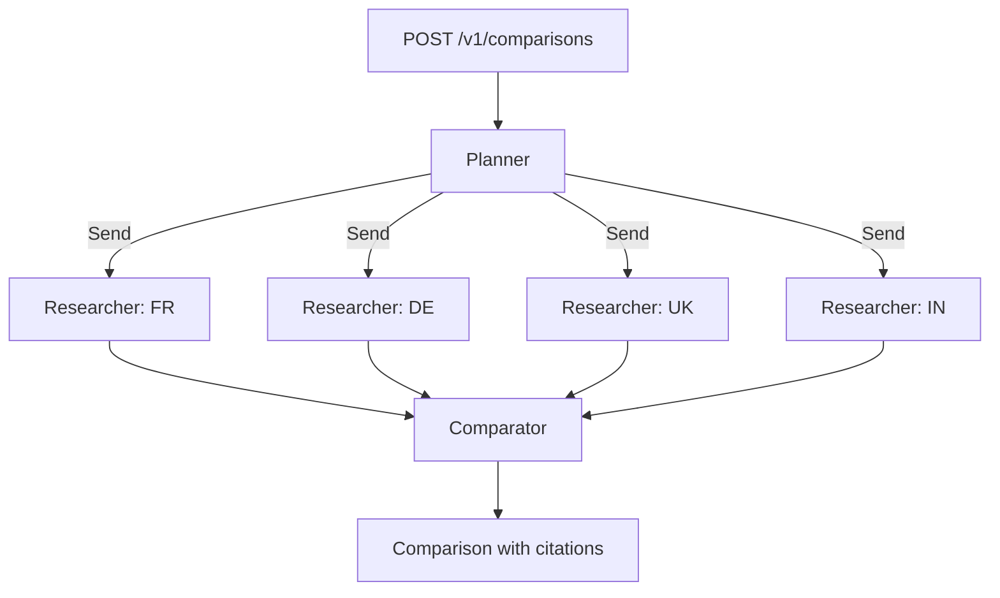

# EvidenceGraph

**Cited, fault-tolerant multi-agent research with LangGraph.**

EvidenceGraph answers research questions by fanning out to isolated agents, collecting
evidence only from trusted sources, and returning one structured answer where every claim
carries a citation.

The first use case:

> Compare the latest EV incentives available in France, Germany, the UK, and India.
> Search official government or trusted sources for each country, extract the eligibility
> rules and benefits, and return one consolidated comparison with citations.

This is a learning project with a production bar. The goal is not a demo. The goal is to be
able to answer, with running code and tests, every question in
[`docs/00-roadmap.md`](docs/00-roadmap.md).

## Status

**Week 1: skeleton.** The graph runs end to end on offline fixture tools. No LLM or live web
calls yet. Fixture results are placeholders, not real policy data.

## Quick start

```bash
uv sync
uv run pytest -q
uv run uvicorn evidence_graph.api.main:app --reload
```

```bash
curl -s -X POST localhost:8000/v1/comparisons -H 'content-type: application/json' -d '{}'
```

## How it works



Each researcher can only reach its own country's official domains. If one researcher fails,
that country is marked `insufficient_evidence` and the rest of the comparison still ships.

## Layout

```text
src/evidence_graph/
  api/          HTTP edge: routes, dependencies. Owns users (week 3).
  graph/        LangGraph: builder + nodes. Owns reasoning.
  tools/        Tool contract, allowlist policy, fixture toolkit. Owns the web.
  state/        Pydantic models + graph state. The shared contract.
  use_cases/    Domain config. ev_incentives/ = countries, allowlists, fixtures.
  config.py     Settings from environment.
tests/          Offline tests. Never hit the live web.
docs/           Learning notebook + roadmap.
```

The dependency direction is one way: `api → graph → tools → state`. The graph never imports
FastAPI. Tools never decide the final answer. The use case plugs in config, not code paths.

## Learning notebook

| Doc | Topic |
|---|---|
| [00-roadmap](docs/00-roadmap.md) | What is done, what is next, week by week |
| [01-problem](docs/01-problem.md) | Problem, scope, non-goals, success criteria |
| [02-architecture](docs/02-architecture.md) | Principles, layers, dependency rules |
| [03-langgraph](docs/03-langgraph.md) | LangGraph, StateGraph, Send, checkpointers |
| [04-state](docs/04-state.md) | Typed state, Pydantic, reducers |
| [05-map-reduce](docs/05-map-reduce.md) | Why this agentic pattern, and what we rejected |
| [06-tools](docs/06-tools.md) | Tool contracts, allowlists, fixtures |
| [07-reliability](docs/07-reliability.md) | Failure isolation, loops, timeouts, fallbacks |
| [08-auth](docs/08-auth.md) | Authentication, authorization, multi-user history |
| [09-observability](docs/09-observability.md) | Tracing, tokens, latency, cost |
| [10-evaluation](docs/10-evaluation.md) | Tests vs evals, goldens, CI gates |
| [11-stack](docs/11-stack.md) | FastAPI, uv, pytest, ruff, pydantic-settings |

Every technology in these docs answers four questions: **What is it? Why do we need it? What
problem does it solve? What happens if we don't use it?**
