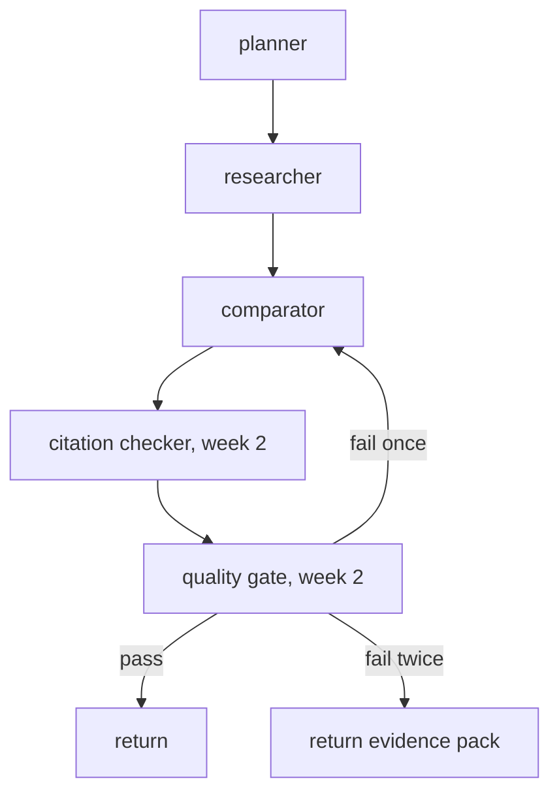

# 05 — Map-reduce: the agentic pattern

Where it lives: [`graph/nodes/`](../src/evidence_graph/graph/nodes/).

## Map-reduce

**What is it?** Split a job into independent pieces (map), run them in parallel, then combine
the results (reduce). Here: one researcher per country, then one comparator.

**Why do we need it?** The four country researches do not depend on each other. France's
answer does not change Germany's.

**What problem does it solve?** Lower latency (parallel), isolated failures (one country at a
time), simple testing (one researcher to test), and a comparator that never touches the web.

**What happens if we don't use it?** See the rejected alternatives below.

## Alternatives we rejected

### One ReAct agent with all tools

A single agent loops: think, call a tool, observe, repeat.

- Rejected because the stop condition is "the model decides it is done", which is unbounded.
- One agent holding all four countries' pages in context is expensive and mixes sources.
- One failure mid-loop usually kills the whole answer.

### Supervisor with free-form sub-agents

A supervisor LLM decides which sub-agent to call next, in any order.

- Rejected because the order is already known. Letting a model pick it adds cost, latency,
  and a new failure mode (routing mistakes) for no benefit.
- Worth revisiting only if later use cases have genuinely dynamic sub-tasks.

### Sequential chain

France, then Germany, then UK, then India.

- Rejected because it is 4× slower and one slow site blocks everything after it.

## When map-reduce is the wrong choice

- Sub-tasks depend on each other's results (then use a sequential or planner-executor graph).
- The set of sub-tasks is discovered during the run (then use a supervisor or iterative planner).
- There is only one sub-task (then use a single node).

## Where the pattern grows

The map and reduce stay the same. Quality control is added as new nodes after the reduce, not
as extra instructions inside existing nodes.
